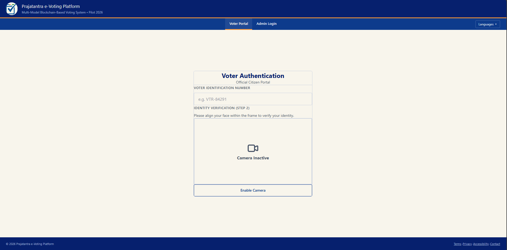

# Multimodal Blockchain based Voting System

[](https://github.com/Mohammed0572/VotingSystem/actions/workflows/codeql.yml)


This project is a highly secure, transparent, and tamper-proof voting system built on the Ethereum blockchain. By integrating advanced facial recognition technology with decentralized smart contracts, the system ensures that elections are fair, verifiable, and completely immune to voter fraud or manipulation.

## Deployed Contract
Network: Ethereum Sepolia Testnet
Contract Address: `0xYOUR_CONTRACT_ADDRESS_HERE`
Etherscan: https://sepolia.etherscan.io/address/0xYOUR_CONTRACT_ADDRESS_HERE

### Dashboard Overview


_The centralized, modern interface for managing the election process securely._

### System Architecture


### Usecase Diagram


---

## How the System Works

The voting process is divided into clear, secure stages to ensure the integrity of the election from start to finish.

### 1. Voter Registration

Before an election begins, eligible voters are registered into the system by the administration.

- The voter's facial biometric data is captured via webcam and securely encoded.
- Each voter is assigned a unique Voter ID linked to their biometric profile.

### 2. Secure Authentication (Face Recognition)

When a voter wants to cast their vote, they must pass a strict authentication process:

- The voter enters their unique Voter ID on the login page.
- The system activates the webcam to perform a live facial scan.
- The live scan is compared against the securely stored biometric data.
- If the face matches, the system verifies the voter's identity and grants them a secure, temporary session to access the voting booth. This prevents anyone from logging in with a stolen password.

### 3. The Voting Process (Blockchain)

Once inside the secure voting dashboard:

- The voter is presented with the list of participating candidates.
- The voter makes their selection and casts their vote.
- The vote is transmitted directly to a **Smart Contract** deployed on the Ethereum blockchain.
- The Smart Contract independently verifies that the voter has not already voted.
- Once verified, the vote is permanently recorded on the blockchain ledger.

### 4. Election Management (Admin Dashboard)

Administrators have access to a separate, secure dashboard where they can:

- Define the election parameters (Start Date and End Date).
- Add or manage the list of candidates.
- Monitor the ongoing election securely.

---

## Core Security Features

- **Facial Recognition Authentication:** You cannot vote using someone else's credentials. The system uses facial recognition to match the voter. _(Note: Active liveness detection/anti-spoofing is currently out of scope for this prototype)._
- **Immutability:** Because votes are stored on the Ethereum blockchain, they cannot be deleted, modified, or tampered with by anyone—not even the administrators.
- **No Single Point of Failure:** Unlike traditional centralized databases that can be hacked to alter vote counts, the decentralized nature of the blockchain ensures the voting data is distributed and secure.
- **Double-Voting Prevention:** The smart contract logic strictly enforces the rule that one person gets exactly one vote. Any attempt to vote twice is automatically rejected by the blockchain network.

---

## CodeQL Security Scan Status

The project utilizes GitHub's automated **CodeQL analysis** to continuously scan the codebase for security vulnerabilities, code quality issues, and compliance.

### Latest Scan Status
- **Status:** [](https://github.com/Mohammed0572/VotingSystem/actions/workflows/codeql.yml) (Passing / Clean)
- **Coverage:** Scans both **JavaScript/TypeScript** (Frontend & Express App) and **Python** (FastAPI Authentication Server) codebases.
- **Trigger:** Automated analysis is performed on every push to the `main` branch, pull requests, and scheduled weekly (every Sunday at 01:30 UTC).

### Security Review Outcomes & Resolved Issues
In recent security remediation cycles, all identified vulnerabilities have been systematically resolved:

1. **Authentication Security & Secret Management**
   - **Remediation:** Split configuration secrets into unique client-side (`NODE_SECRET_KEY`) and server-side (`FASTAPI_SECRET_KEY`) JWT signing secrets.
   - **Production Hardening:** Integrated `envalid` to validate required environment variables at startup, disabling dangerous fallback defaults in production.
2. **Brute-Force & Denial of Service (DoS) Mitigation**
   - **Rate Limiting:** Integrated `slowapi` (backed by Redis with an in-memory fallback for local dev) on the FastAPI face authentication endpoints. `/verify-face` is rate-limited to 5 requests per minute per IP, and `/enroll-face` is limited to 10 requests per minute per IP.
   - **Payload Size Guards:** Implemented strict request payload limits (maximum of 2MB per image sequence) to block memory-exhaustion DoS attacks.
3. **Input Sanitization & Injection Prevention**
   - **Form Field Safety:** Implemented strict `maxLength={64}` limits and disabled auto-completion on Login views.
   - **Regex Restraints:** Added paste listeners (`handlePaste`) to reject non-alphanumeric inputs or values exceeding length limits.
   - **Vote Integrity:** Enforced candidate verification checks on vote submissions in the frontend, preventing attempts to inject invalid candidate IDs.
   - **Unused Code Cleanup:** Completely removed the experimental MongoDB backend (`server/` directory) to reduce the attack surface and eliminate potential NoSQL injection vectors.
4. **Replay & Side-Channel Protections**
   - **Anti-Replay Nonces:** Added cryptographic random UUID nonces and timestamps to verification requests to block capture-and-replay exploitation.
   - **Information Disclosure Mitigation:** Removed the face-matching proximity `distance` score from the public `/verify-face` response payload to prevent side-channel reverse-engineering of user faces.
5. **Secure Headers & Strict CORS**
   - **Response Hardening:** Added middleware to both Express and FastAPI servers to set strict `Content-Security-Policy` (CSP), `Permissions-Policy` (camera enabled only for self, microphone/geolocation disabled), `X-Frame-Options: DENY`, `X-Content-Type-Options: nosniff`, and `Referrer-Policy` headers.
   - **Origin Restriction:** Configured CORS origins on the FastAPI server to strictly allow only the specified frontend origin.

### Outstanding Findings
- **None:** There are currently no outstanding security alerts or vulnerabilities detected by CodeQL.

---

## Project Structure

```text
├── backend/                      # Python FastAPI server (face_auth) & face recognition scripts
├── blockchain/                   # Solidity smart contracts, migrations, and Truffle configs
├── deploy/                       # Docker orchestration & deployment configs (nginx, vercel)
├── docs/                         # Project documentation and security notes
├── src/                          # Frontend source files (HTML/CSS/JS/TS)
├── index.ts                      # Express server entry point (Frontend)
└── README.md                     # Documentation
```

---

## Getting Started Locally

Follow these steps to download and run the project on your local machine.

### Prerequisites

- [Node.js](https://nodejs.org/) (v18+)
- [pnpm](https://pnpm.io/) (`npm install -g pnpm`)
- [Python](https://www.python.org/) (v3.10 recommended)
- [Ganache](https://trufflesuite.com/ganache/) (Local Ethereum blockchain)
- [MetaMask](https://metamask.io/) browser extension
- [Truffle](https://trufflesuite.com/truffle/) (`npm install -g truffle`)
- Webcam (for facial recognition)

### 1. Download the Repository

You can either fork the repository on GitHub or download it directly to your machine:

```bash
git clone https://github.com/Mohammed0572/VotingSystem.git
cd VotingSystem
```

### 2. Install Dependencies

Install the Node.js packages for the frontend using `pnpm`:

```bash
pnpm install
```

Install the Python packages for the Face Authentication API:

```bash
cd backend/face_auth
pip install -r requirements.txt
cd ../..
```

_(Note: The `face_recognition` Python library requires `dlib`, which may need CMake and a C++ compiler installed on your system.)_

### 3. Configure the Environment

Copy the example environment files and set them up:

```bash
cp .env.example .env
cp backend/face_auth/.env.example backend/face_auth/.env
```

Generate two unique secure secret keys by running this command twice:

```bash
node -e "console.log(require('crypto').randomBytes(64).toString('hex'))"
```

Place one key as `NODE_SECRET_KEY` in the root `.env` file, and the other as `FASTAPI_SECRET_KEY` in `backend/face_auth/.env`.

### 4. Start the Blockchain (Ganache)

1. Open **Ganache** and create a new workspace (e.g., named "development").
2. Link it to the `blockchain/truffle-config.js` file in the project root.
3. Configure your **MetaMask** extension to connect to `http://localhost:7545` (Chain ID 1337) and import an account using one of Ganache's private keys.

### 5. Compile and Deploy Smart Contracts

Open a terminal in the root directory. You can deploy either to your local Ganache network or to the public Sepolia testnet.

**For Local Development (Ganache):**

```bash
cd blockchain
npx truffle compile
npx truffle migrate
```

**For Public Testnet (Sepolia):**
Ensure you have set the `SEPOLIA_RPC_URL` (e.g., from [Alchemy](https://alchemy.com) or [Infura](https://infura.io)) and `MNEMONIC` in your `.env` file, and that your account has some Sepolia testnet ETH.

```bash
cd blockchain
npx truffle compile
npx truffle migrate --network sepolia
```

### 6. Build or Run the Frontend

The frontend uses Vite and React. You can either run the development server or build for production.

**For Development (Recommended):**

```bash
npm run dev
```

**For Production:**

```bash
npm run build
npm run serve
```

### 7. Run the Servers

You need to run two servers simultaneously in separate terminals:

**Terminal 1: Start the Face Auth API**

```bash
cd backend/face_auth
python -m uvicorn main:app --host 127.0.0.1 --port 8000 --reload
```

**Terminal 2: Start the Frontend Server**
If you are using the development server, `npm run dev` is already running. If you built for production, ensure `npm run serve` is running.

### 8. Access the App

Open your web browser and go to:

- **http://localhost:5173** (if using `npm run dev`)
- **http://localhost:8080** (if using `npm run serve`)

---

## Testing

This project includes automated testing suites for the Smart Contracts, Backend API, and Frontend components.

### 1. Smart Contracts (Truffle)

The solidity smart contracts are tested using Truffle and Mocha/Chai. Ensure Ganache is running before executing the tests.

```bash
cd blockchain
npx truffle test
```

### 2. Backend API (pytest)

The FastAPI backend is tested using `pytest`. The tests mock the face recognition modules to run quickly without needing real webcam input.

```bash
cd backend/face_auth
pytest
```

### 3. Frontend (Vitest)

The React frontend components are tested using Vitest and React Testing Library.

```bash
npm run test
```

---

## Contributors

This system was developed as a Major Project at K.S. School of Engineering and Management by:

- [**toxicbishop**](https://github.com/toxicbishop)
- [**Mohammed0572**](https://github.com/Mohammed0572)
- [**supr1795**](https://github.com/supr1795)
- [**Rohithgaloth**](https://github.com/Rohithgaloth)

## License

This project is licensed under the MIT License. See the [LICENSE](LICENSE) file for details.
